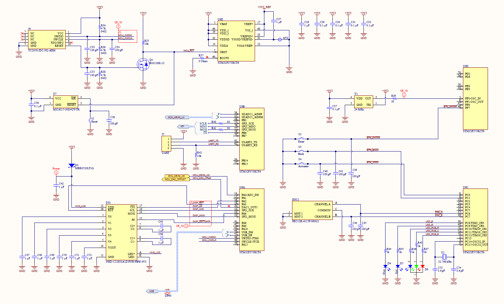

# FL-0004 Power Rail Probe

A DC-coupled, high-offset range G=1 amplifier allowing noise and ripple 
measurements on power rails. 

## Why?

I needed a power rail probe (like [this](https://www.keysight.com/zz/en/product/N7020A/power-rail-probe-2-ghz.html)) 
to make some ripple and transient response measurements on a 18V power supply. 
A power rail probe allows the user to null out the DC component of the 
measured supply and view the remaining noise, ripple, load response, etc. 
DC coupled. Those residual signals are typically best viewed in the 100mV or 
lower ranges of an oscilloscope, where a typical oscilloscope front end doesn't 
have enough offset range to null out the large (potentially 10s of volts) DC 
offset. While AC coupling *does* allow measurement of high frequency ripple, 
it comes with other drawbacks: 

* AC coupling typically requires the oscilloscope to be configured for 1MΩ input
impedance, potentially degrading signal integrity for high frequency noise. 
* Using a 10x probe to improve this performance can introduce additional noise
in the measurement. 
* The DC blocking capacitor and 1MΩ input impedance create a low-frequency 
rolloff (typically ~5Hz or lower). Low frequency characteristics of the 
signal get masked, particularly DC offsets caused by power supply loading. 
* I don't get to bring up "I have a power rail probe" at the next department
 happy hour.

While there are commercially available solutions for this, 
all had a few drawbacks that made them unattractive for my purposes: 
1. My daily-driver scope is a Siglent. At the time, Siglent didn't offer a 
power railprobe compatible with their oscilloscopes' interface. 
(They [do now](https://siglentna.com/product/power-rail-probe-sap4000p/))
2. Compatibility aside, they're expensive. Like, on the order of how much I 
spent just on my oscilloscope levels of expensive. 
    * If I **had** the budget to buy a Tektronix, Keysight, Rohde and Schwarz, 
or other "big girl" oscilloscope, maybe I'd also have the budget to drop 
$5k-$10k on a single probe for it, but that's not where I'm at today
3. Buying an off the shelf probe wouldn't give me an excuse to play around 
with some analog engineering.
4. Buying one means I don't get to bring up "I build my own power rail probe" 
at the next department happy hour.

## Design Goals

Hitting the multi-GHz bandwidth and noise performance of one of the 
commercially-available probes is tough. Keysight and Tektronix have teams 
that can fabricate custom ASICs to wring every last drop of performance out of 
their design. I'm limited to what I can buy off the shelf. Fortunately, I also 
don't need a *ton* of bandwidth for what I'm interested in, which is stability 
and transient response of power supplies with loop bandwidths down in the 
sub-100kHz range. So I can relax my requirements a bit. After some thinking, 
I decided on the following:

* Reasonably low loading >1kΩ to avoid measurements loading the circuit under test
* High bandwidth, at least 10MHz, ideally 100MHz or more
* Gain of 1x to reduce noise and simplify measurements
* Large offset range, ±20V at minimum, ±25V or more ideally
* As low of noise as I can reasonably achieve
* Digitally controlled offset and trim controls
    * Trimmer resistors would have been simpler, but are prone to drift and 
noise. Ideally I wanted a fully closed-box calibration that could be run by a 
script if needed
* Power and data via USB-C
* Usable standalone - important information, like the current offset voltage,
should be displayed on the device

## Implementation

There are a couple of techniques that could be used to implement this design. 

One approach is to split the signal path into one low-frequency path, 
handling DC up to perhaps 1MHz with a low-noise op amp, and a separate 
high-frequency path taking over from 1MHz upwards.

I decided against this approach to avoid having to try and design a crossover 
circuit that smoothly transitioned between the two stages and remained stable 
in both magnitude and phase response over temperature, drift over time, etc. 
I also felt that the required components to adjust and compensate that 
crossover would violate my closed-box calibration requirement. 

The second approach, which I took, was to use an off-the-shelf high-speed 
op amp. The entire amplifier stage for the probe then becomes an inverting 
summing amplifier, allowing potentially very large offset ranges quite easily, 
as the main "measurement" signal path can be configured for a gain of G=-1, 
while the offset path can use a higher gain (say, G=-10) allowing relatively 
small offset signals to null out a much larger input voltage. This input stage 
can then be followed by a simple inverter to yield the overall G=1 response we 
want. 

Modern high-speed op amps can offer unity-gain bandwidths well in excess of 
500MHz and reasonably low input noise. However, that bandwidth does come with 
drawbacks. Most of the highest-speed op amp options use current-feedback 
topologies, which present a very low impedance at their inverting input. The 
OPA695 I used in this design has a specified 20Ω inverting input resistance, 
and expects feedback components in the range of a few hundred ohms for best 
performance. Conforming to the recommended resistances would mean a probe input 
resistance of a few hundred ohms as well, potentially significantly loading the 
circuit under test and creating a significant power dissipation issue in the 
design (20V across a 100Ω input resistor would mean dissipating 4W of power, 
which is not practical). 

One technique to work around this input impedance limitation is to add an 
additional differential amplifier buffer stage to the op amp front end. This 
isolates the input circuitry from the loading of the op amp inputs, and allows 
some of the op amp's limitations to be overcome. There are excellent examples 
of Hewlett-Packard using this technique on many of their DMMs - by adding a 
very large matched JFET pair in front of a low-drift, low-noise bipolar-input 
op amp, they significantly reduced overall voltage noise while maintaining very 
high input impedance. 

I opted for a similar JFET-enhanced approach to reduce input bias current and 
input current noise. While a bipolar transistor pair would offer reduced 
voltage noise, its higher current noise combined with the fairly high 
impedances in the feedback network would likely result in overall worse noise 
performance. I selected Linear Systems' LSK589 JFET pair as a reasonable 
compromise. Its 4nV/rtHz voltage noise is comparable to the op amp, it offers 
low input capacitance, and reasonable performance out to the 100MHz goal 
bandwidth. 

### Architecture

#### Front End

The probe front end consists of the LSK589 matched JFET pair Q1, high-speed 
op amps U1 and U2, and biasing circuitry Q2, Q3, and associated resistors. 
At its heart is a differential source-follower (Q1) with a current mirror active 
load (Q2, Q3, and resistors R10-R16). Biasing is a typical ~5mA per leg, 
provided by Q2A (mirrored from Q2B). Q3, R15, R16, and digital potentiometer U3 
provide an additional 550-600µA of bias current allowing additional trimming of 
the input offset voltage if needed. 

The op amp and additional input stage are configured as an inverting summing 
amplifier, with a G=-1 path comprising 10kΩ resistors R4 and R8 and 
compensation capacitor C3, and a low-frequency offset input comprising R8 
(10kΩ) and R5 (1kΩ) for an offset input gain of G=-10. Stability simulations 
revealed the need for additional compensation, which is provided by C4 and R6. 

U2, R9, and R7 provide a classic inverting G=-1 amplifier which likely needs no 
further explanation.

#### ADC/DAC Interface

All DAC and ADC inputs and outputs range from 0 to 3.0V (provided from a 
precision voltage reference), requiring scaling and filtering to interface 
with the front end circuitry. 

Offsets for this block require a -3.0V reference. This is provided by inverting
amplifier U5A. 

The microcontroller's DAC outputs range from 0 to 3.0V, which is scaled and 
offset by inverting summing amplifier U5B to produce a -3V to 3V offset 
control to the front end, providing up to ±30V of input offset range.

Both halves of op amp U4 are used as ADC drivers, with a DC gain of -0.75x and 
an offset of -1.5V. This maps ±2V of output voltage from the front end into 
the full ADC range, making ADC voltage calculations a clean power-of-two 
division. 

Both ADC drivers are implemented as multiple-feedback second-order lowpass 
filters. The driver for the 16-bit Sigma-Delta ADC (U4A) has a cutoff frequency 
of 2.5kHz, chosen to attenuate noise for better DC accuracy, while the driver 
for the 12-bit ADC (U4B) has a 50kHz cutoff frequency for faster transient 
response.

#### Microcontroller

The digital section of the design is fairly straightforward. Human interface is 
provided through a rotary encoder and 3 pushbuttons. A basic 128x32 dot LCD and
a selection of LEDs provide feedback to the user. 

Programming and debug are accomplished through an optional UART header and a 
Tag-Connect plug-of-nails cable. 

I opted to add a supply watchdog to ensure clean startup, though the STM32's 
internal POR is likely sufficient. 

#### Power

The analog circuitry mostly runs from bipolar ±5V supplies. U10, an SN6501 
push-pull converter, transformer T1, and diode bridge D8, D9, D11, and D12 
generate an unregulated bipolar ±6.2V output. This is then fed through a pair 
of well-damped LC pi filters before feeding linear regulators that power the 
rest of the circuit. ±5V power to the analog circuitry is provided by a 
TPS7A3901 regulator which ensures symmetric monotonic startup of the bipolar 
supply. 

+3.3V power for the digital logic is provided by a jelly-bean 1117 LDO. 

### Layout
I designed this project around OSHPark's 6-layer stackup. All signal routing
is on the top and bottom layer, with high-speed traces routed as microstrip, 
primarily on the top layer.

Layers 2 and 5 are solid groundplanes to provide good reference planes for the
outer layers. 

Layers 3 and 4 are split planes for the ±5V and +3.3V power supplies, plus a 
few traces to escape the EMI shields around the front end and ADC interface 
circuits. 

Ample keepouts were added at the top and bottom to ensure the PCB would fit 
cleanly into a Hammond Manufacturing 1455J1201 enclosure. 

### Errata and Known Issues

ADC interface - R20 and R21 are swapped. 
Microcontroller - "R" and "B" labels for the RGB LED are swapped. 
Microcontroller - Provision should be made to prevent a UART cable from 
powering the board. Either add a level shifter, a resistor to more easily 
disconnect pin 1 of the UART header, or eliminate the 3.3V pin from the header 
altogether. 

## Results

Initial testing appears promising. I haven't had time yet to fully characterize 
the design's performance, but some testing with an AWG does show the probe 
passing signals through as expected. Thus far, each of the blocks does appear 
to be functional, and without clear stability issues or unusual behavior.
